<h1> KIK ANIME </h1>

<h3> VISÃO GERAL </h3>
<ul>
    <li> HEADER: links de Redes sociais; </li>
    <li> CAROUSEL: imagens responsivas; </li>
    <li> CATEGORIAS: filtro por categorias cadastradas; </li>
    <li> PORTFÓLIO: estampas dos produtos cadastradas no banco de dados; </li>
    <li> CARRINHO: vinculado ao IP do usuário. </li> 
</ul>

<h3> FOOTER </h3>
<ul>
    <li> CONTATO: envia informações para e-mail cadastrado; </li>
    <li> SOBRE: informações gerais e modal; </li>
    <li> LOGIN: acesso ao painel do administrador. </li>
</ul>

<h3> MODÚLO ADM </h3>
<ul>
    <li> LOGIN  DO ADMINISTRADOR; </li>
    <li> LISTA DE PRODUTOS: produtos listados por ordem alfabética; </li>
    <li> Cadastro de produtos; </li>
    <li> Edição de produto; </li>
    <li> Exclusão de produtos.</li>
</ul>

<h3> MODÚLO CLIENTE </h3>
<ul>
    <li> CADASTRO DE CLIENTE; </li>
    <li> LOGIN DE CLIENTE; </li>
    <li> HEADER: após login, exibe o nome do cliente e meus pedidos.</li>
     
    <h4> CARRINHO DO CLIENTE: após login </h4>
    <li> Exibe o nome do cliente; </li>
    <li> Carrinho associado ao Id do cliente; </li>
    <li> Remove produtos do carrinho. </li>
     
    <h4> FINALIZAR COMPRAS </h4>
    <li> Verificação de login; </li>
    <li> Resgata informações da compra e do produto. </li>
     
    <h4> MEUS PEDIDOS</h4>
    <li> Exibe compras anteriores; </li>
    <li> Resgata informações da compra. </li>
</ul>
  
<h1> FOTOS DO SISTEMA </h1>
<h4> INDEX </h4>
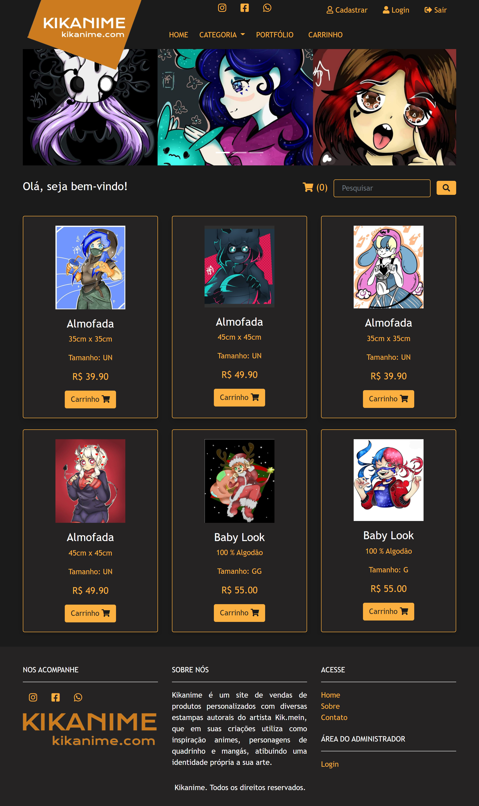
 
<h4> FOOTER </h4>
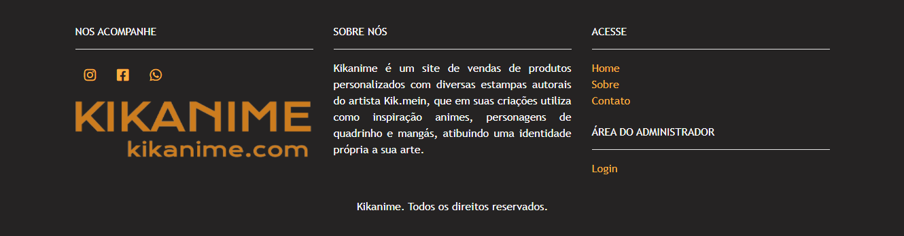
 
h4> LISTA CATEGORIAS </h4>
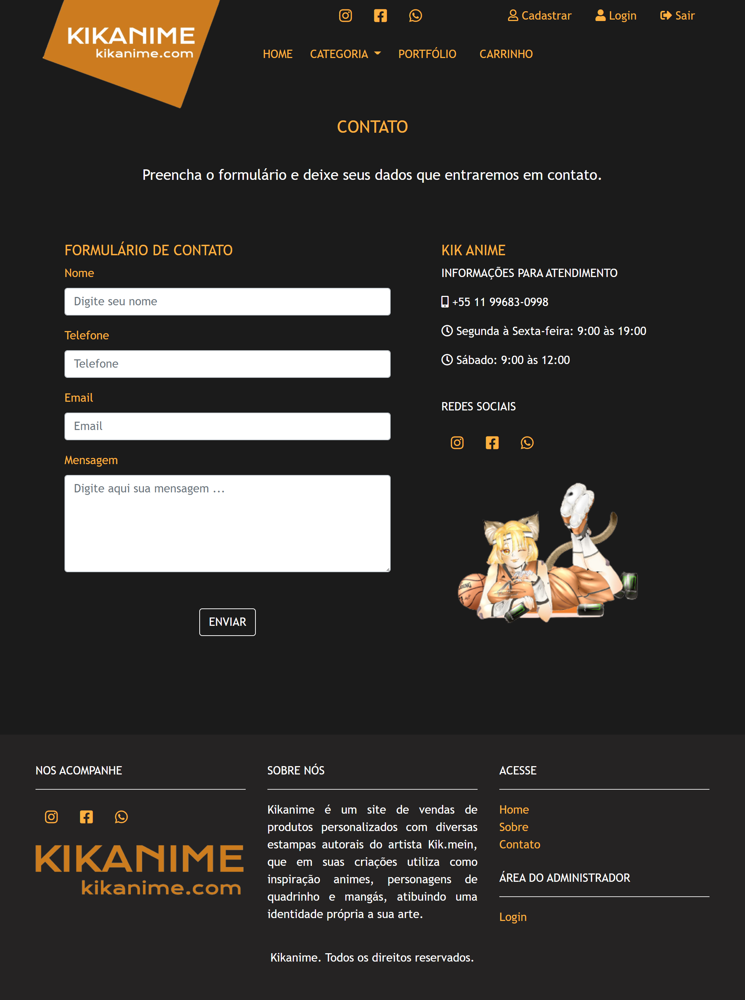
 
<h4> PORTFÓLIO </h4>
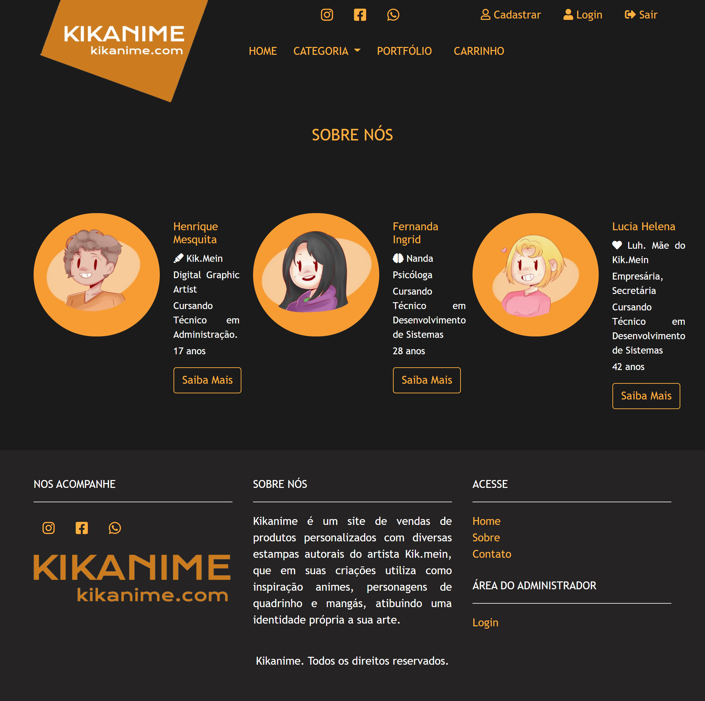
 
<h4> CONTATOS </h4>
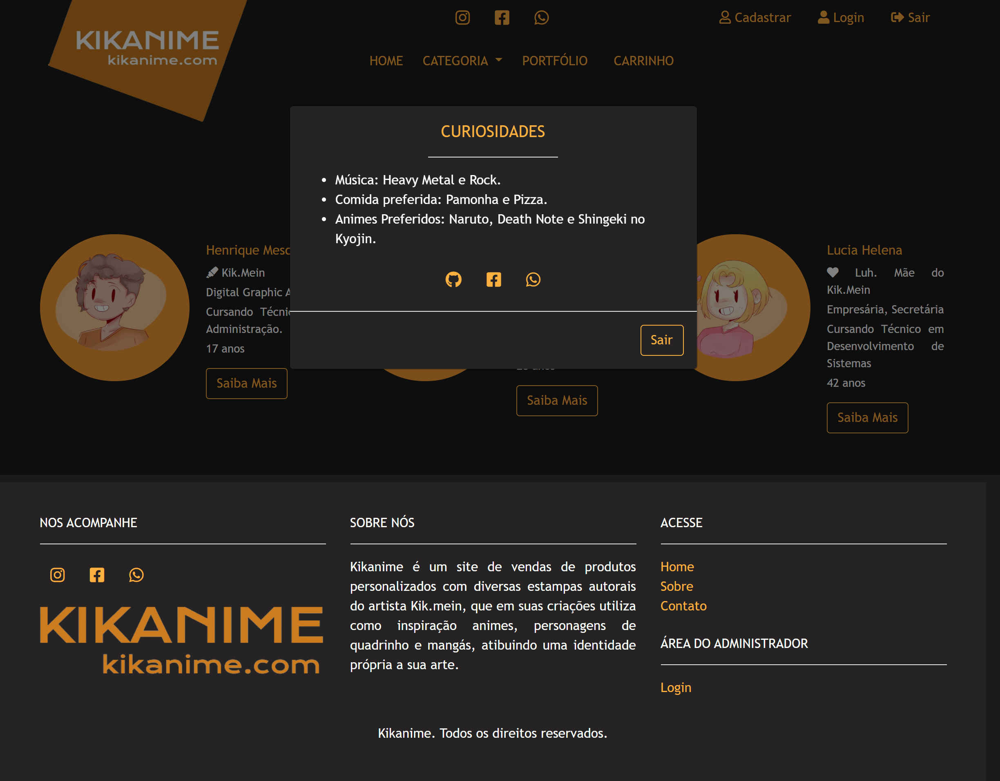
 
<h4> SOBRE </h4>
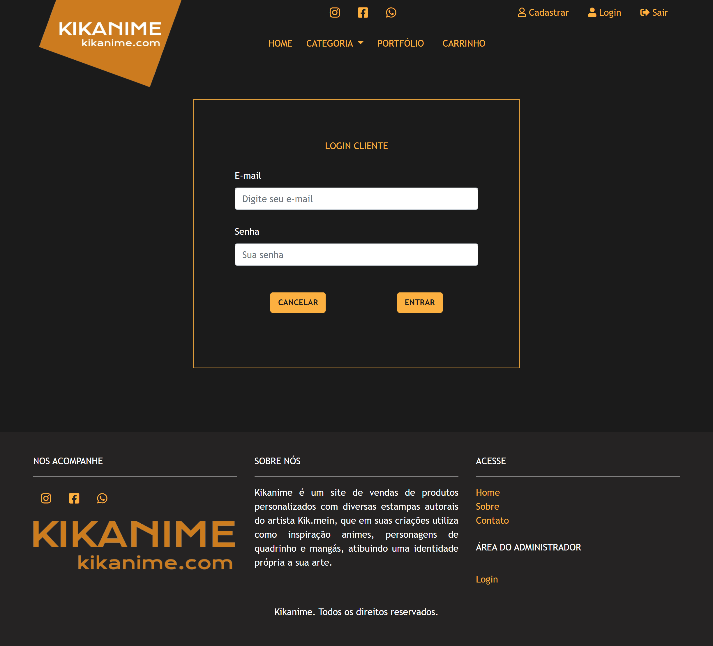
 
<h4> MODAL SOBRE </h4>
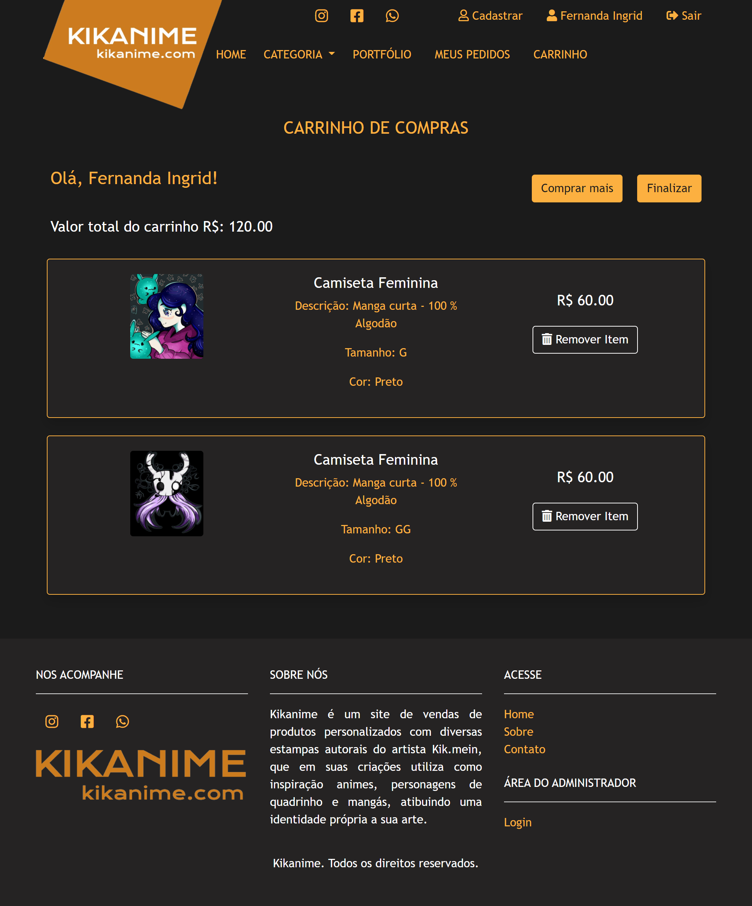
 
<h4> LOGIN CLIENTE </h4>
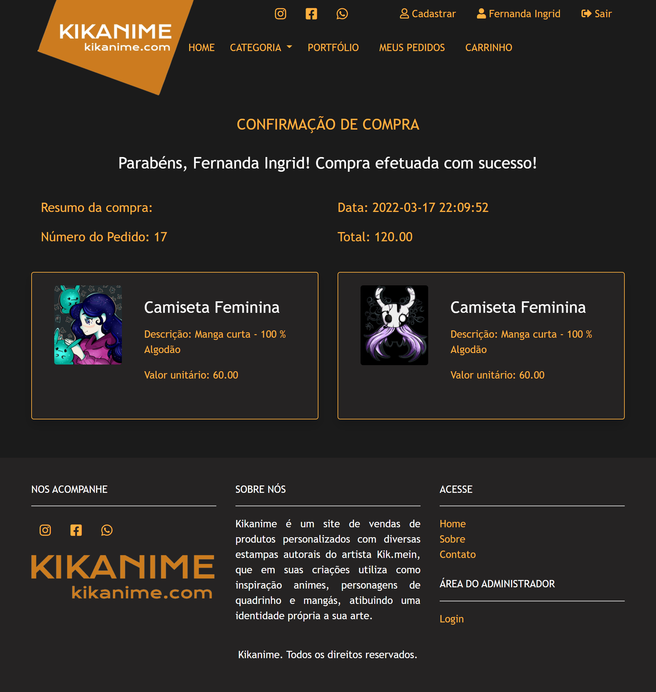
  CARRINHO CLIENTE </h4>
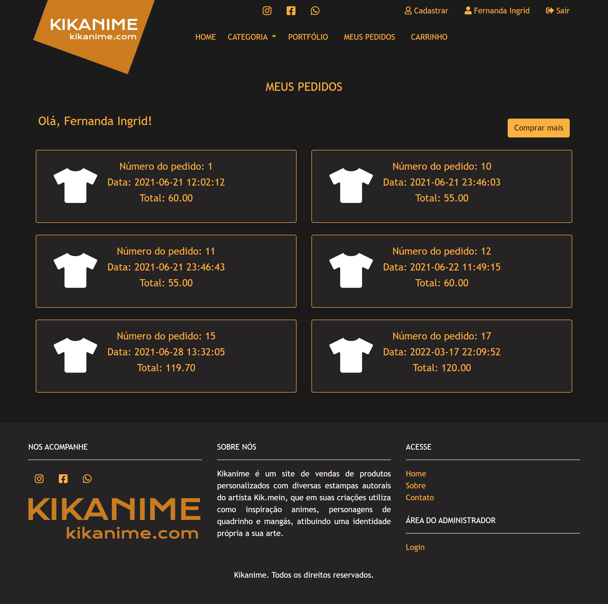
 
<h4> CONFIRMAÇÃO COMPRA </h4>
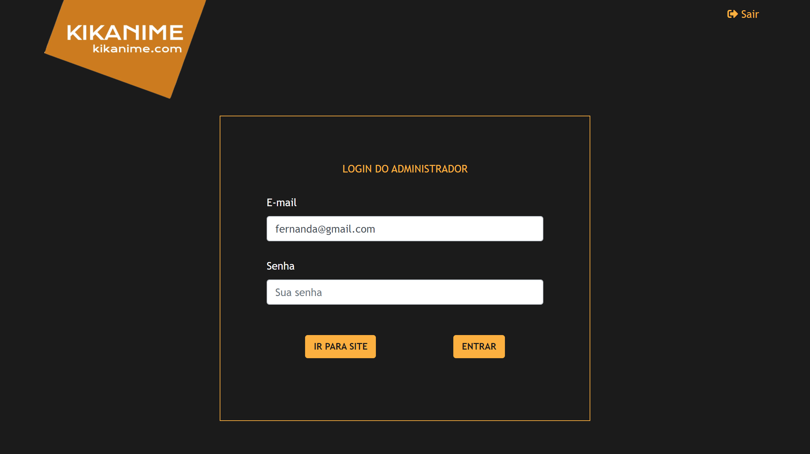
 
<h4> MEUS PEDIDOS </h4>
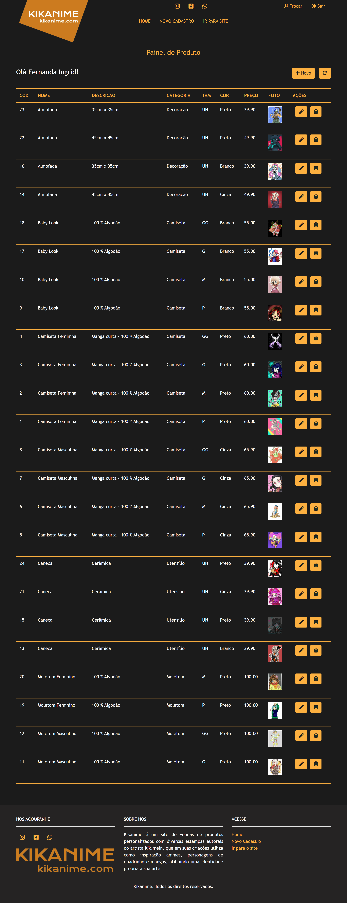
 
<h4> PAINEL DE PRODUTOS </h4>
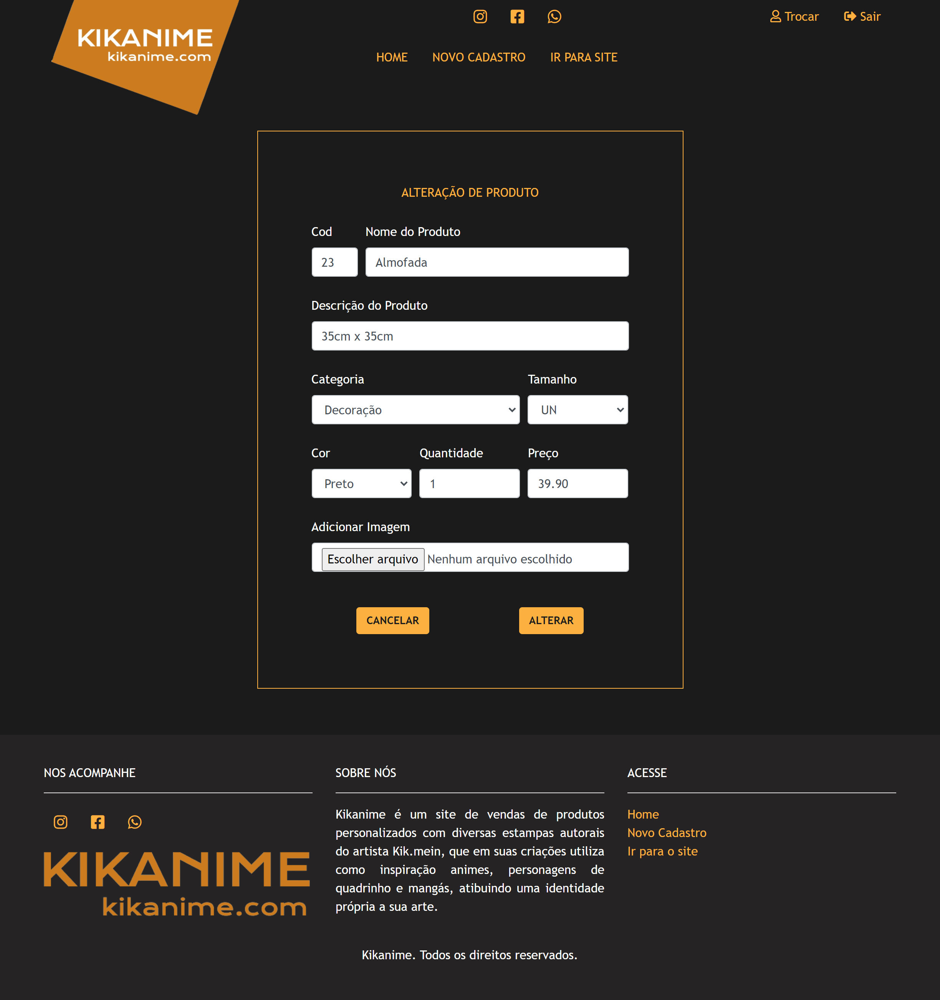
  ALTERAÇÃO DE PRODUTOS </h4>
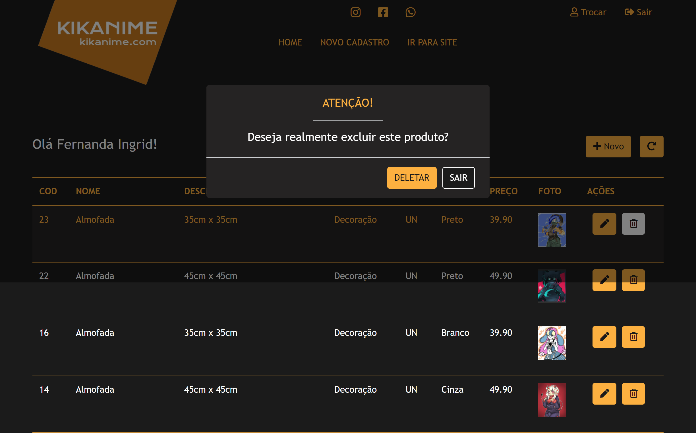
 
<h4> DELETA PRODUTOS </h4>
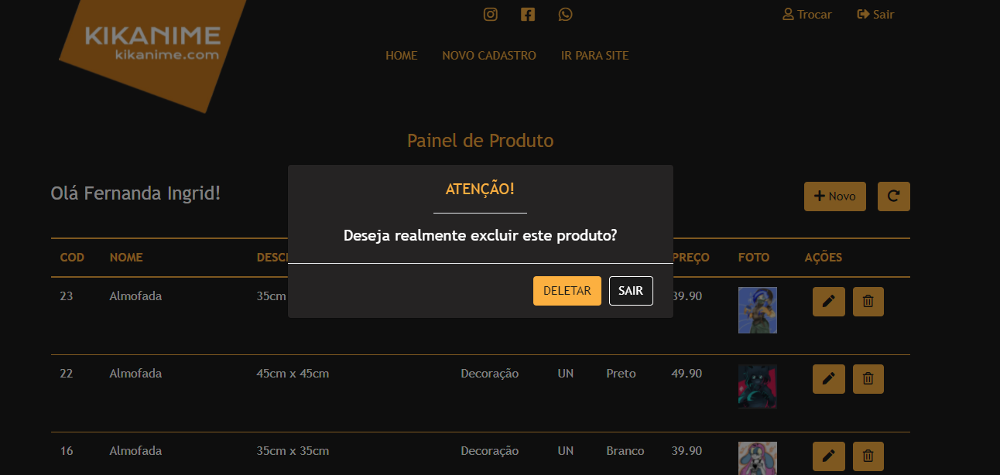
